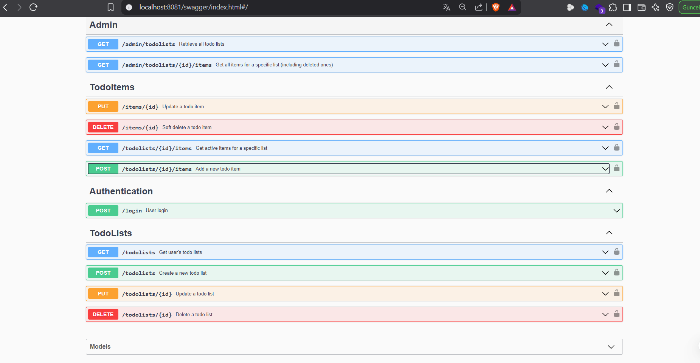

# 📝 PriviaTodoList - REST API Todo Uygulaması

### 📚 İçindekiler

`📌` [Genel Bakış](#genel-bakış)  
`🚀` [Özellikler](#özellikler)  
`🛠️` [Teknoloji Yığını](#teknoloji-yığını)  
`🧱` [Mimari](#mimari)  
`📡` [API ENDPOINTLERİ](#api-endpointleri)  
`🚀` [Başlangıç](#başlangıç)  
`📘` [API Dokümantasyonu](#api-dokümantasyonu)  
`👤` [Admin Kullanıcı](#admin-kullanıcı)  
`👨‍💻` [Normal Kullanıcı](#normal-kullanıcı)

---

## 📌 Genel Bakış <a id="genel-bakış"></a>
**PriviaTodoList**, kullanıcıların yapılacaklar listesi oluşturup yönetmelerine olanak tanıyan **Go** ile geliştirilmiş bir RESTful API backend servisidir.  
Kullanıcılar görevlerini takip edebilir, tamamlandı olarak işaretleyebilir ve ilerlemelerini tamamlanma yüzdeleri ile izleyebilirler.

---

## 🚀 Özellikler <a id="özellikler"></a>

- ✅ JWT tabanlı kimlik doğrulama  
- 🧾 Yapılacaklar listesi yönetimi (oluşturma, okuma, güncelleme, silme)  
- 🗂️ Liste içindeki görev öğelerinin yönetimi  
- 🛡️ Rol tabanlı erişim kontrolü (normal kullanıcılar / yönetici)  
- 🗑️ Yumuşak silme işlevi  
- 🕒 Zaman damgalarının otomatik takibi  
- 📊 Tamamlanma yüzdesi hesaplama  

---

## 🛠️ Teknoloji Yığını <a id="teknoloji-yığını"></a>

- **Dil:** Go  
- **Framework:** Gin Web Framework  
- **Dokümantasyon:** Swagger  
- **Veri Depolama:** Bellek içi mock veritabanı  
- **Kimlik Doğrulama:** JWT (JSON Web Token)  

---

## 🧱 Mimari <a id="mimari"></a>

Uygulama, **temiz mimari** desenini takip eder:


- ├── controllers/ # HTTP istek işleyicileri
- ├── docs/ # Swagger dokümantasyonu
- ├── middleware/ # JWT kimlik doğrulama ve hata işleme
- ├── mockdb/ # Bellek içi veri depolama
- ├── models/ # Veri yapıları
- ├── repositories/ # Veri erişim katmanı
- ├── routes/ # API rota tanımları
- ├── services/ # İş mantığı
- ├── utils/ # Yardımcı fonksiyonlar
- └── main.go # Uygulama giriş noktası


---

## 📡 API ENDPOİNTLERİ



### 🔐 Kimlik Doğrulama
- `POST /api/v1/login` – Kullanıcıyı doğrular ve JWT token döner

### 📋 Yapılacaklar Listeleri (Kullanıcı)
- `GET /api/v1/todolists` – Kullanıcının tüm listelerini getirir  
- `POST /api/v1/todolists` – Yeni liste oluşturur  
- `PUT /api/v1/todolists/{Listeid}` – Listeyi günceller  
- `DELETE /api/v1/todolists/{Listeid}` – Soft silme işlemi yapar  

### 📌 Yapılacak Öğeler
- `GET /api/v1/todolists/{Listeid}/items` – Liste içindeki öğeleri getirir  
- `POST /api/v1/todolists/{Listeid}/items` – Listeye yeni öğe ekler  
- `PUT /api/v1/items/{Itemid}` – Öğeyi günceller  
- `DELETE /api/v1/items/{Itemid}` – Öğeyi Soft siler  

### 🔒 Sadece Yönetici
- `GET /api/v1/admin/todolists` – Tüm listeleri getirir (silinmişler dahil)  
- `GET /api/v1/admin/todolists/{Listeid}/items` – Belirli listenin tüm öğelerini getirir  

---

## 🚀 Başlangıç <a id="başlangıç"></a>

### ✅ Gereksinimler

- Go 1.16 veya üzeri

### 🔧 Kurulum

1. Depoyu klonlayın:
    ```bash
    git clone https://github.com/sebahattinn/PriviaBACKEND.git
    ```

2. Proje dizinine gidin:
    ```bash
    cd PriviaBACKEND
    ```

3. Bağımlılıkları yükleyin:
    ```bash
    go mod download
    ```

4. Uygulamayı çalıştırın:
    ```bash
    go run main.go
    ```

📍 Sunucu varsayılan olarak [`http://localhost:8081`](http://localhost:8081) adresinde çalışır.

---

## 📘 API Dokümantasyonu <a id="api-dokümantasyonu"></a>

Swagger arayüzüne şu adresten erişebilirsiniz:  
[`http://localhost:8080/swagger/index.html`](http://localhost:8080/swagger/index.html)

---

## 👤  Admin Kullanıcı <a id="admin-kullanıcı"></a>
- admin1
- admin

### 👨‍💻 Normal Kullanıcı <a id="normal-kullanıcı"></a>
- user1
- 1234
